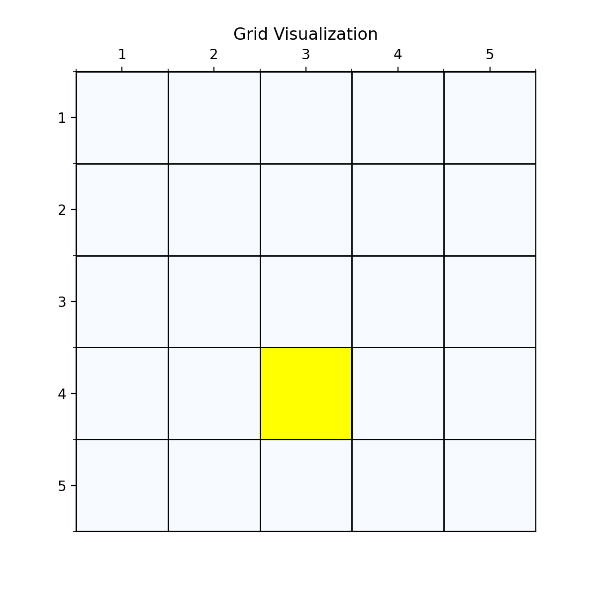
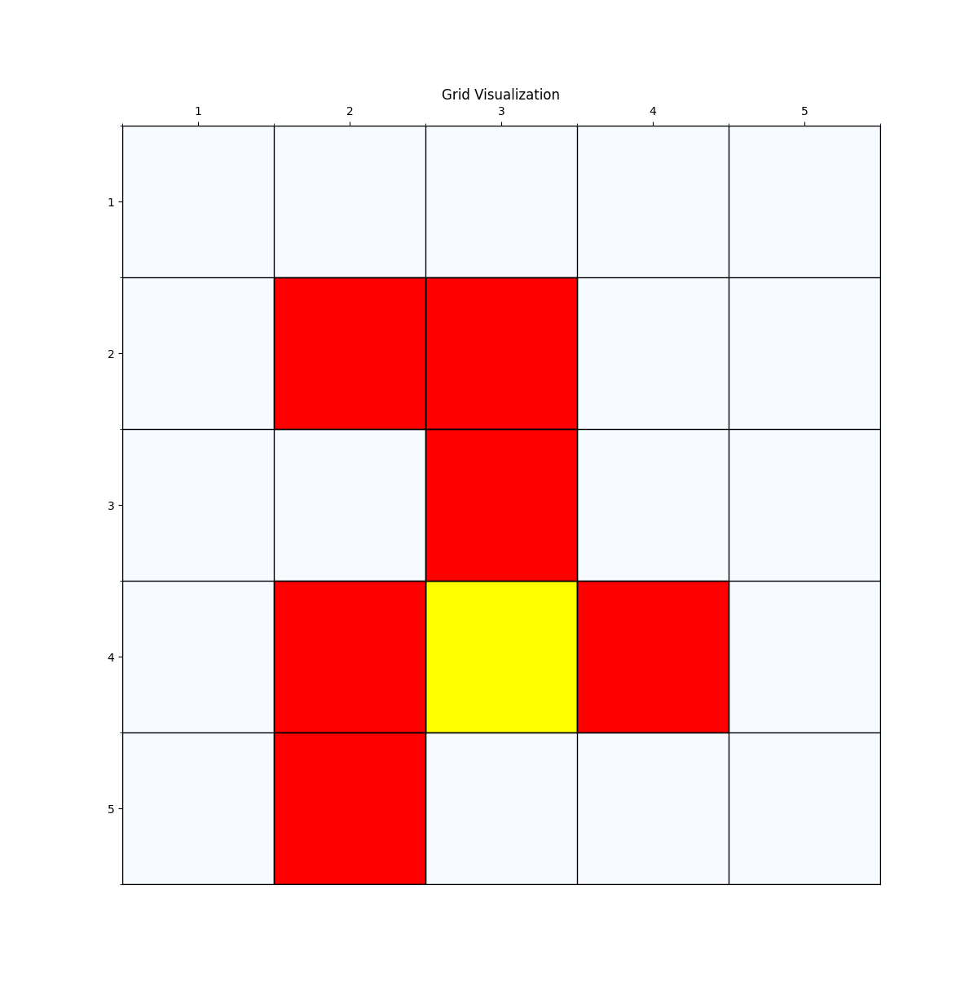
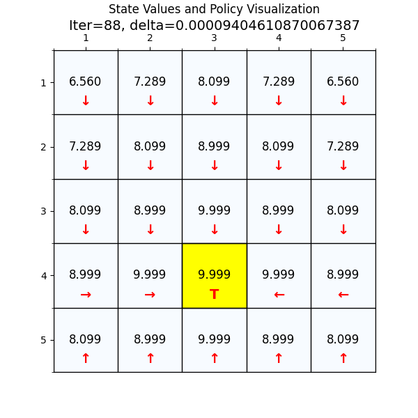

# Big Talk Reinforcement Leanring - Code
---------------------------------------------------------------------
[中文](https://github.com/delltower/big_talk_reinforcement_learning_code/blob/main/README-zh.md)  
---------------------------------------------------------------------
This repository is an implementation of the basic algorithm of reinforcement learning, and uses a grid world as a display, including visualization of the grid world and visualization of strategies, to assist in learning reinforcement learning.
# Code Description
**grid.py**  
The environment where the agent is located, the implementation of the grid world, can be configured with grid size, boundaries, reward rewards, endpoints, prohibited areas, all of which can be visualized.

The red grid is the prohibited area, and the yellow grid is the endpoint  
---------------------------------------------------------------------
**grid_value.py**  
Implementation of Value Iteration Algorithm  
  
The result graph of the value iteration algorithm, indicating the state value and policy

